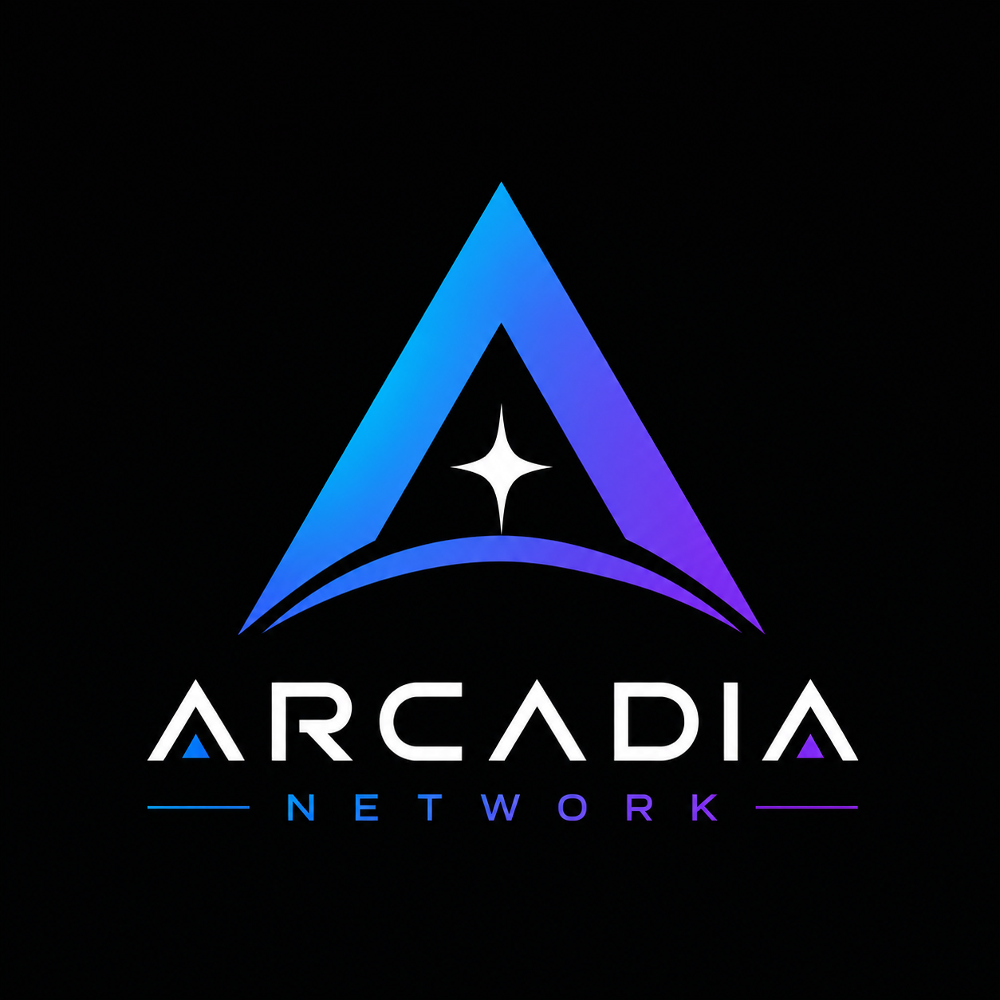

# Arcadia Network

> **Building the Infrastructure for Autonomous Digital Worlds**

Arcadia Network is a next-generation Layer-1 blockchain designed for AI, Web3 Gaming, NFTs, Creator Economy, and Digital Identity.

---

## Vision

To create the world's most scalable and developer-friendly blockchain for intelligent applications and digital ownership.

---

## Key Features

- High-performance Layer-1
- AI-ready infrastructure
- Web3 Gaming
- NFT Marketplace
- Digital Identity
- Creator Economy
- Fast 10-second block time
- Proof-of-Stake consensus
- Community Governance

---

## Native Token

| Item | Value |
|------|-------|
| Token | ARCDIA |
| Type | Utility |
| Genesis Supply | 100,000,000 |
| Max Supply | 1,000,000,000 |

---

## Token Utility

- Transaction Fees
- Validator Staking
- Governance
- NFT Marketplace
- AI Service Payments
- Ecosystem Rewards

---

## Documentation

- Whitepaper
- Tokenomics
- Roadmap
- Security Policy

---

## Website

Coming Soon

---

## Status

Concept Demonstration Project
